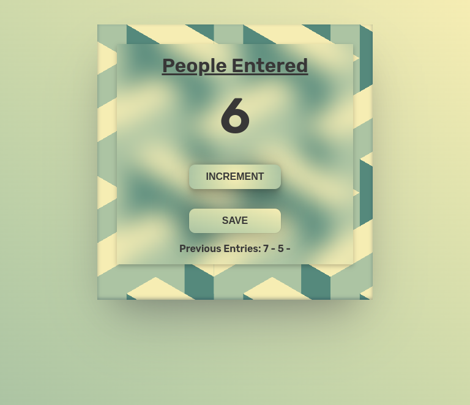

# JavaScript-practice-folder

practice folder of JavaScript learning

### PROJECT 1 Passenger Count Card

- In this project user can count the number of people by clicking 'INCREMENT' button, and can save it with 'SAVE' button.
- By saving count will start from '0' as for counting another group of people.
- Save Entries will be show at the bottom.

## Screenshot

