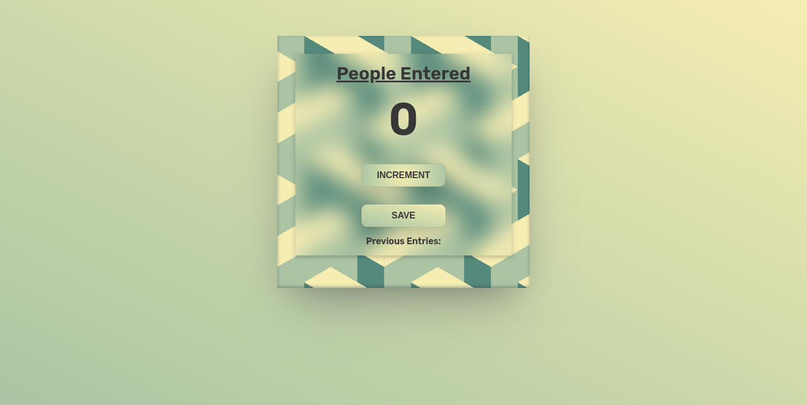

# JavaScript-practice-folder

practice folder of JavaScript learning

### PROJECT 1 Passenger Count Card

- In this project user can count the number of people by clicking 'INCREMENT' button, and can save it with 'SAVE' button.
- By saving count will start from '0' as for counting another group of people.
- Save Entries will be show at the bottom.

## Screenshot

#

#

#

#

#

### Project 2 Blackjack Game

- In this game project there are three outcome to the game
  1. Do you want to draw a new card? (if sum is less than 21)
  2. You've got a blackjack! (if sum is equal to the 21) (game will end here.)
  3. You're out of the game (if sum is more than 21) (game will also end here)
- you can start the game with `START GAME ` button.
- And can add the new card with `NEW CARD` button.

## Screenshot

#

#

#

#

#

### Project Chrome Extension : Leads tracker

- In this project I have created a chrome extension called "Leads tracker".
  - this extension will save the save url that user type in.
  - also by clicking `save tab` it will save the current url of the browser.
  - clicking `delete all ` will delete the all url that is saved by user, even from the local storage.
- this extension save the `URL` in local storage so user can see them even after closing the browser or system and commig back.

# Screenshot

